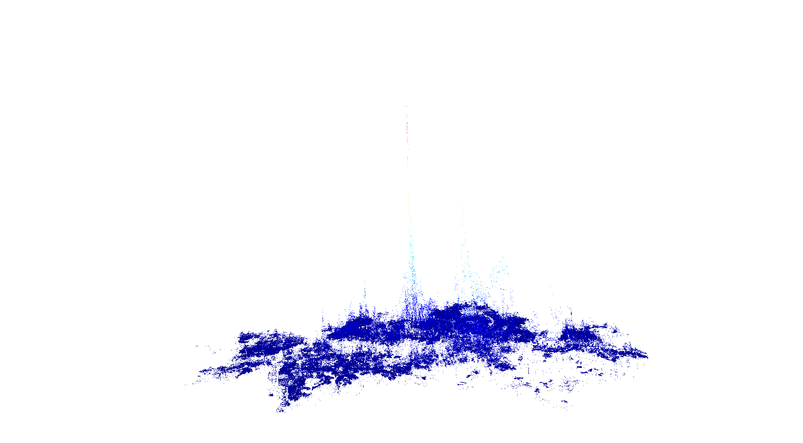

# Real Estate Analytics & ML Portfolio

This repository captures my end-to-end applied machine learning and geospatial analytics work for the Seoul metropolitan real estate market. It brings together raw government datasets, feature engineering pipelines, 900+ research notebooks, and production-focused tooling that supports acquisition, valuation, and procurement decisions.

## Quick Facts
- **Scope:** 931 curated notebooks spanning residential pricing, land valuation, data engineering, automation, and modeling experiments.
- **Data footprint:** 20+ public datasets sourced from Korean national and municipal portals (국토교통부, 한국부동산원, 서울시 열린데이터 광장, 등).
- **ML toolchain:** LightGBM, CatBoost, scikit-learn, SHAP, and custom feature stores orchestrated with pandas/Dask.
- **Automation:** Selenium-based procurement scrapers, coordinate enrichment utilities, and 3D visualization outputs (pptk, vispy, open3d).

## Visual Portfolio
<p align="center">
  
</p>
<p align="center">
  <em>Seoul-wide building footprint map synthesized from cadastral and coordinate datasets.</em>
</p>
<p align="center">
  
</p>
<p align="center">
  <em>3D valuation intensity visualization highlighting vertical price gradients across districts.</em>
</p>

## Data Sources & Coverage
| Directory | Description | Notes |
|-----------|-------------|-------|
| `data/raw/한국부동산원`, `data/raw/한국부동산원_주택가격지수` | Nation-wide price indices, transaction histories, and survey data | Harmonized to monthly/quarterly cadences for trend modeling |
| `data/raw/국토교통부_*` | Building registries (표제부, 층별개요, 총괄표제부) and land transactions | Foundation for structural feature engineering and zoning compliance |
| `data/raw/서울_열린데이터_광장_서울특별시_부동산_실거래가_정보` | Seoul open real estate transactions | Core training signal for supervised models |
| `data/raw/지하철역`, `data/raw/좌표데이터*`, `data/raw/위치정보요약DB` | Spatial reference layers and geocoding assets | Enable walkability, transit accessibility, and coordinate enrichment |
| `data/processed/Production_Prep`, `data/processed/feature_maps` | Refined feature tables and KPI dashboards | Produced by repeatable notebooks in `notebooks/data_preparation` |
| `data/processed/구별_실거래가_지도`, `data/processed/노원구_1년내_SH_LH_거래사례.xlsx`, ... | District-level market analysis deliverables | Shared with stakeholders to prioritize acquisition targets |

## Analytical Workstreams
- **Residential market intelligence:** `notebooks/analysis_residential/` (471 notebooks) benchmark price bands, volume trends, and micro-market anomalies across Seoul boroughs down to building clusters.
- **Land valuation:** `notebooks/analysis_land/` (134 notebooks) blends 토지특성정보, zoning layers, and 거래가 data to price parcels and test redevelopment scenarios.
- **Data preparation & feature stores:** `notebooks/data_preparation/` (140 notebooks) handle address normalization, coordinate stitching, zoning joins, and categorical encoding, culminating in reusable tables under `data/processed/`.
- **Training & modeling:** `notebooks/training/` (79 notebooks) iterate on LightGBM/CatBoost pipelines with KFold + GroupKFold validation, feature selection (VIF, SHAP dropouts), and hyperparameter sweeps.
- **Procurement automation:** `notebooks/procurement/` scripts combine Selenium, API integrations, and scoring logic to surface SH & LH portfolio opportunities, flagging multi-unit bundles and pricing anomalies.
- **Maps & visualization:** `notebooks/maps/` generates interactive folium dashboards and 3D point-cloud renderings using pptk/vispy for executive storytelling.

### Flagship Notebooks
- [Core feature engineering pipeline](notebooks/data_preparation/%EB%A9%94%EC%9D%B8_%EB%8D%B0%EC%9D%B4%ED%84%B0_20060101_20210416_ver_3%20-%20%EC%A2%8C%ED%91%9C%20%EC%A0%81%EC%9A%A9.ipynb)
- [Model tuning & evaluation (LightGBM, KFold)](notebooks/training/Training%2025%20-%20training%20data%20ver%2016%20-%20KFold%20shuffle%20-%20l2%20tuning.ipynb)
- [District-level pricing analysis](notebooks/analysis_residential/%EC%A7%91%EA%B0%92%EB%B6%84%EC%84%9D%20-%20%EC%86%A1%ED%8C%8C%EA%B5%AC%20%EC%84%9D%EC%B4%8C%EB%8F%99%20%EC%97%B0%EB%A6%BD%EB%8B%A4%EC%84%B8%EB%8C%80%2020210513.ipynb)
- [Selenium procurement automation](notebooks/procurement/%EC%9D%BC%EA%B4%84%EA%B5%AC%EB%A7%A4%20%EC%B0%BE%EA%B8%B0%20-%2010%ED%98%B8%20%EC%9D%B4%EC%83%81%20(%EC%95%84%ED%8C%8C%ED%8A%B8%20%ED%8F%AC%ED%95%A8)%20-%20SH%20%26%20LH%20%EC%B0%BE%EA%B8%B0%20-%20selenium.ipynb)

## Modeling & Experimentation
- **Versioned training sets:** `artifacts/models/training_runs/Training_*` store successive dataset revisions (ver_10 through ver_22) with documented feature deltas and preprocessing choices.
- **Algorithms:** Blend gradient boosting (LightGBM, CatBoost) with linear and tree-based baselines; leverage `probatus` for calibration/diagnostics and `statsmodels` for inferential checks.
- **Evaluation strategy:** Cross-validation notebooks (e.g., `Training 18 - ... huber`, `Training 25 - ... l2 tuning`) log regression Huber losses, RMSE comparisons, and shap value audits. Group-aware folds mitigate data leakage across building complexes.
- **Explainability:** SHAP analyses (`Training 28-45` series) measure feature attributions, guide top-N feature selection, and capture narrative-ready charts embedded in notebooks.
- **Feature engineering:** Projects under `projects/real_estate_ml/` stitch cadastral shapes, land-use tags, and transit accessibility into modeling datasets using Dask for scale and Numba for targeted speedups.

## Automation & Decision Support
- **Selenium procurement crawlers:** `notebooks/procurement/일괄구매 찾기 ...` automate public housing listings, enrich with proprietary scoring, and export ranked opportunities to Excel.
- **Geospatial utilities:** Coordinate prep notebooks (`...좌표 데이터 준비`, `polylabel 활용`) compute centroids, derive frontage metrics, and prepare shapefiles for GIS or 3D viewers.
- **Reporting assets:** Processed outputs (e.g., `data/processed/지역별_땅값_일괄매매_평균.xlsx`) feed stakeholder dashboards and pitch decks.

## Technical Stack
- **Languages & tooling:** Python 3.13, JupyterLab, pandas, numpy, Dask, multiprocessing, tqdm.
- **Modeling:** LightGBM, CatBoost, scikit-learn, probatus, statsmodels, SHAP, SciPy.
- **Visualization:** Matplotlib, Seaborn, Folium, PPTK, VisPy, Open3D.
- **Automation & APIs:** Selenium, webdriver-manager, requests, custom geoband integrations (optional).
- **Environment management:** `requirements.txt` and `pyproject.toml` mirror dependencies; extras (`visual3d`, `domain`) toggle heavy visual or domain-specific packages.

## Reproducing the Workspace
```bash
python3 -m venv .venv
source .venv/bin/activate
pip install -e .[visual3d,domain]  # drop extras if unnecessary
jupyter lab
```
1. Register the kernelspec: `python -m ipykernel install --user --name real-estate-venv`.
2. Place/update raw datasets under `data/raw/` (see table above for naming conventions).
3. Run notebooks in this order: `notebooks/data_preparation` → `notebooks/training` → `notebooks/analysis_*` to regenerate processed tables and analytical decks.
4. Export stakeholder deliverables from `data/processed/` or replicate visuals via `notebooks/maps/`.

## Repository Layout
```
├─ data/
│  ├─ raw/            # Immutable source acquisitions from government portals
│  ├─ processed/      # Engineered datasets, KPIs, Excel deliverables
│  └─ external/       # Placeholder for third-party sources
├─ notebooks/
│  ├─ analysis_residential/
│  ├─ analysis_land/
│  ├─ data_preparation/
│  ├─ training/
│  ├─ procurement/
│  ├─ maps/
│  └─ misc/
├─ projects/real_estate_ml/  # End-to-end feature engineering & modeling pipelines
├─ artifacts/models/         # Model runs, CatBoost diagnostics
├─ docs/                     # Screenshots, references, contributor guides
├─ config/                   # API keys, secrets templates (gitignored in production)
├─ resources/                # Fonts and shared static assets
└─ AGENTS.md                 # Contributor & coding standards
```

## Impact & Outcomes
- Supported acquisition due diligence by ranking SH/LH bulk purchases, highlighting mixed asset buildings, and exporting prioritized lead lists.
- Built reusable feature stores and model evaluation tracks that reduce onboarding time for new experiments and guard against data drift.
- Delivered geospatial storytelling assets (point clouds, heat maps, folium dashboards) used in executive briefings and investor updates.

## Roadmap
- Migrate recurring pipelines to parametrized Papermill/nbclient jobs for automated refreshes.
- Harden procurement scrapers with retry/backoff logic and dataset diffing for change detection.
- Publish a lightweight API or Streamlit app exposing top acquisition candidates and scenario toggles.